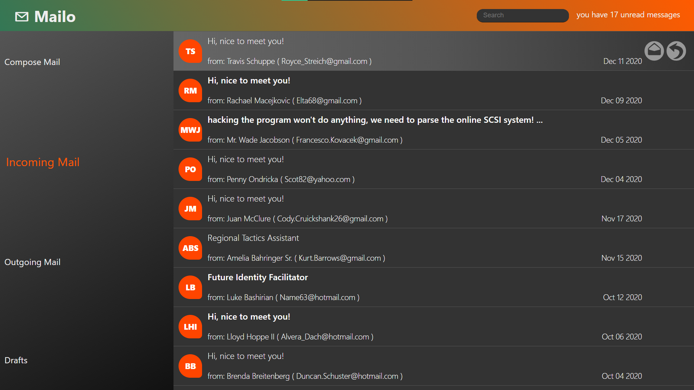

# ✉ Mailo
see it [deployed](https://alonbru.github.io/Mailo/)  
a sample mail app.  
**stack**: ReactJS with mock data.

## features:
- pure (S)CSS! no premade components were used,hardly any packages.
- See and search all "Incoming mails"
- unread mails are bold, also counted
- "Send" a mail
- Save a Draft, send it later
- Sent mails are listed in "Outgoing Mails"
- Reply: automatically adds the recipient, previous message, and "Re:" to email subject.
- PWA installable (on gh-pages https).